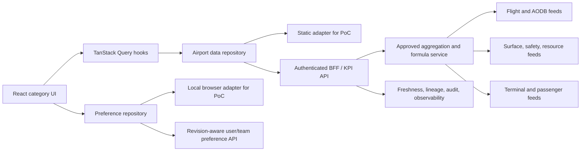

# Airport Operations Dashboard — architecture, UI, and test review

Review date: 19 September 2026  
Reviewed baseline: local `main` at `f2d14ba`  
Scope: active React application, static KPI calculation layer, responsive grid, persistence, accessibility behavior, unit tests, Playwright tests, production build, and the documented path from PoC to a real airport system.

## Executive assessment

The PoC has a sound frontend foundation: stable KPI IDs, typed category and metric contracts, deterministic fixtures, runtime validation for layouts, an asynchronous source interface with cancellation, explicit layout edit drafts, accessible Radix dialogs, and a production build that is fully static. Those decisions can support a read-only pilot.

The baseline is not production-ready. The largest risks are data ownership and failure semantics rather than React itself. All 71 KPI definitions, records, filtering, and aggregation currently live in one 990-line browser module. A real deployment needs server-owned snapshots with schema validation, per-source freshness and quality, partial failure handling, airport and user identity, permissions, and revision-aware server preferences.

The review also found user-visible defects that the passing suite missed. Category time ranges leak into other categories, filter selections disappear on reload despite the documented contract, the mobile grid briefly renders off-canvas, the mobile header compresses its controls, KPI search lacks combobox behavior, and the documented height actions are absent. Two of the four passing unit-test files exercise an older dashboard implementation that the shipped application does not import.

## Evidence and baseline

- `npm run check` passed: TypeScript, ESLint, 32 Vitest tests, and the Vite production build.
- The existing Chromium Playwright suite contains 14 tests. It covers all 71 focus dialogs, category inventory, basic layout drag/resize persistence, storage recovery, theme behavior, automated axe checks, and selected presentation behavior.
- The production build has a 386.85 kB chart chunk (110.04 kB gzip), a 281.63 kB workspace vendor chunk (83.87 kB gzip), and a 218.84 kB React vendor chunk (68.25 kB gzip).
- A 390 px browser measurement immediately after first render recorded `document.scrollWidth = 604` and cards extending to `x = 603.9`. After 750 ms the grid settled to 390 px and every card aligned at `x = 16`. This proves a transient responsive-layout flash that the settled-state test does not detect.
- The mobile baseline screenshot is [review-before-mobile.png](../screenshots/review-before-mobile.png). It shows the category breadcrumb wrapping into a narrow 75 px-tall column beside currency, timezone, and theme controls.
- Browser reproduction recorded `hour` after moving from Airside Operations to Passenger Flow, although the latter category had never selected that range.
- Browser reproduction recorded terminal `all` after selecting `T2` and reloading.
- The KPI search input has no `role`, `aria-expanded`, or `aria-controls`; pressing Escape leaves the result panel open.
- The editing menu contains Data table, Move earlier/later, Standard width, Full width, and Hide KPI. It does not contain the documented Taller or Shorter actions.
- A record at 00:15 IST is shown as `00:15 IST · 18:45 UTC`; it omits that UTC is on 16 September.

## Findings

| ID        | Priority                             | Area                         | Finding                                                                                                                                                                                                                      | Evidence / consequence                                                                                                                                                  | Baseline status                                            |
| --------- | ------------------------------------ | ---------------------------- | ---------------------------------------------------------------------------------------------------------------------------------------------------------------------------------------------------------------------------- | ----------------------------------------------------------------------------------------------------------------------------------------------------------------------- | ---------------------------------------------------------- |
| UI-01     | High                                 | Responsive grid              | React Grid Layout animates from an initial wider layout into the mobile layout, producing transient horizontal overflow and off-canvas cards.                                                                                | Immediate width 604 px at a 390 px viewport; settled width later becomes 390 px. Users can see or capture the invalid state, and the current test waits past it.        | Open                                                       |
| UI-02     | High                                 | Mobile header                | The mobile header keeps navigation, breadcrumb, currency, timezone, and theme controls in one horizontal composition. The breadcrumb wraps into a very narrow column and several targets are only 30–38 px high.             | Mobile screenshot and geometry: first group is 88.7 px wide and 75 px high; menu button is 30 px square.                                                                | Open                                                       |
| STATE-01  | High                                 | Filters                      | `range` is global component state while all other filters are keyed by category. It therefore leaks between categories.                                                                                                      | Selecting Last hour in Airside and navigating to Passenger Flow leaves Last hour selected.                                                                              | Open                                                       |
| STATE-02  | Medium                               | Filters                      | Category filter memory exists only in React state and is lost on reload, while the README says it is persisted by `workspace.ts`.                                                                                            | Selecting T2 in Passenger Flow and reloading restores All terminals.                                                                                                    | Open                                                       |
| A11Y-01   | Medium                               | Search                       | KPI search is a visual popup without combobox/listbox state, keyboard navigation, Escape dismissal, or an explicit relationship between input and results.                                                                   | Missing ARIA attributes; Escape leaves one results panel in the DOM.                                                                                                    | Open                                                       |
| LAYOUT-01 | Medium                               | Layout controls              | The reducer supports taller/shorter actions but the menu never exposes them. Mobile disables freeform resize, so mobile users have no height adjustment at all.                                                              | Menu item inventory and architecture documentation disagree.                                                                                                            | Open                                                       |
| TIME-01   | Medium                               | Timezones                    | Dual-zone interval labels omit the UTC date when local and UTC fall on different days.                                                                                                                                       | `00:15 IST · 18:45 UTC` is ambiguous; the UTC instant belongs to 16 September.                                                                                          | Open                                                       |
| DATA-01   | High when monetary metrics are added | Currency correctness         | Detail tables convert numerator and denominator using the KPI display unit. A future revenue KPI could convert a transaction count or another non-money denominator as if it were currency.                                  | `detailRows` applies `convertValue` to value, numerator, denominator, and reference. Field-level semantics are not typed.                                               | Open                                                       |
| DATA-02   | Low                                  | Currency UI                  | The selector is functional but none of the current 71 KPI specifications has a monetary unit, so changing currency has no visible metric effect.                                                                             | The current browser test only proves that a non-monetary value stays unchanged. This is a documented fixture limitation, but the control needs clearer context.         | Open                                                       |
| ARCH-01   | High                                 | Code ownership               | The repository contains the unused original 13-widget application, its data layer, layout store, registry, and tests alongside the active 71-KPI application.                                                                | `App.tsx` imports only `categories/CategoryApp`; old `domain.test.ts` and `layout.test.ts` still pass against code that is not shipped.                                 | Open                                                       |
| ARCH-02   | Production gate                      | Data architecture            | `categories/source.ts` combines metric definitions, fixture construction, aggregation, source implementation, query hook, and grouping in 990 lines. The browser is authoritative for production-sensitive KPI calculations. | Hard to assign formula ownership, independently test adapters, validate API data, or deploy definition versions safely.                                                 | Requires backend/data design                               |
| ARCH-03   | Production gate                      | Resilience                   | A category snapshot is one all-or-nothing result and metric state is limited to ready, empty, or not-applicable.                                                                                                             | One feed failure cannot be represented without failing the whole category. There is no stale, degraded, permission-denied, source timestamp, quality, or lineage state. | Requires API contract                                      |
| ARCH-04   | Production gate                      | Identity and configuration   | Airport ID, name, timezone, fixture date, storage keys, and query keys are duplicated constants. There is no authenticated user, role, airport entitlement, or tenant boundary.                                              | Unsafe for a multi-airport deployment and makes configuration drift likely.                                                                                             | Partly fixable locally; auth requires platform integration |
| ARCH-05   | Production gate                      | Preferences                  | Layouts are browser-local and saved as a whole document without a revision, user identity, or cross-tab conflict policy.                                                                                                     | Concurrent tabs can overwrite each other. Users cannot carry layouts between workstations or share an approved operations-room view.                                    | Requires preferences service                               |
| ARCH-06   | Medium                               | Deep links                   | The URL contains only the category. Filters and focused KPI are not encoded.                                                                                                                                                 | Operators cannot share or reopen an exact investigation state, and support teams cannot reproduce one from a URL.                                                       | Open for future product decision                           |
| ARCH-07   | Medium                               | Theme system                 | The CSS contains 110 literal color declarations and light mode is largely implemented by selector overrides.                                                                                                                 | Adding high-contrast, airline branding, or more semantic states will require broad selector edits.                                                                      | Incremental refactor recommended                           |
| PERF-01   | Medium at pilot scale                | Loading                      | Recharts and grid dependencies are loaded on the initial route, and the chart chunk is 110 kB gzip. All records for the active category are sent to the browser.                                                             | Acceptable for this static PoC; a production history view needs route/code splitting plus server aggregation and bounded windows.                                       | Measure in pilot                                           |
| TEST-01   | High                                 | Test relevance               | Two passing Vitest files validate the unused legacy application. One active migration test imports a legacy layout factory, coupling the new suite to dead runtime code.                                                     | The headline “32 tests passed” overstates coverage of the shipped application.                                                                                          | Open                                                       |
| TEST-02   | High                                 | Responsive tests             | The existing width test checks only eventual document width and card count. It does not assert immediate overflow, individual card bounds, overlap, alignment, header geometry, or target size.                              | UI-01 and UI-02 pass the current suite.                                                                                                                                 | Open                                                       |
| TEST-03   | High                                 | State tests                  | A test named “filters are scoped per category” checks only terminal reset. It does not exercise range isolation or reload persistence.                                                                                       | STATE-01 and STATE-02 pass the suite.                                                                                                                                   | Open                                                       |
| TEST-04   | Medium                               | Export/data tests            | CSV coverage verifies only the filename. Currency coverage verifies only that a non-money KPI does not change.                                                                                                               | Incorrect headers, rows, active-filter values, escaping, and future monetary conversion could ship undetected.                                                          | Open                                                       |
| TEST-05   | Medium                               | Accessibility/browser matrix | Automated browser tests run only Chromium. There is no manual screen-reader record, Firefox/WebKit project, or keyboard-only layout workflow test.                                                                           | Production acceptance across airport-managed devices is unproven.                                                                                                       | Production acceptance gate                                 |
| TEST-06   | Production gate                      | Integration failures         | There are no tests for partial feed failure, stale data, schema rejection, permission denial, out-of-order responses, refresh gaps, or preference revision conflict.                                                         | These states do not exist in the current static contract.                                                                                                               | Add with production adapters                               |

## Test coverage assessment

| Capability                            | Current evidence                                                                                   | Assessment                                | Required action                                                                                                                     |
| ------------------------------------- | -------------------------------------------------------------------------------------------------- | ----------------------------------------- | ----------------------------------------------------------------------------------------------------------------------------------- |
| KPI inventory and basic finite values | Exact 71 IDs and category counts; every KPI has observations and a finite default value            | Strong for fixture completeness           | Keep                                                                                                                                |
| Formula reconciliation                | Incursion, resource reporting, queue distinction, zero/unavailable cases                           | Useful but narrow relative to 71 formulas | Add per-family boundary and denominator fixtures as definitions are approved                                                        |
| Category navigation                   | All categories, history, reload                                                                    | Good                                      | Keep                                                                                                                                |
| Layout lifecycle                      | Draft, hide, restore, save, one pointer drag and east-edge resize                                  | Good happy-path coverage                  | Add height actions, immediate responsive geometry, storage revision conflict when service exists                                    |
| Filter behavior                       | One dimension and a few selector calculations                                                      | Incomplete                                | Add category range isolation, persisted category filters, every supported dimension, incompatible combinations, and reset isolation |
| Focus views                           | Opens all 71 and checks observer count returns to baseline                                         | Strong smoke coverage                     | Retain; add detail-content assertions by renderer family                                                                            |
| Export                                | Download filename only                                                                             | Weak                                      | Parse the CSV and validate headers, escaping, filtered values, units, and row counts                                                |
| Accessibility                         | Axe on selected dark/light overview/focus states; dialog focus restoration is exercised indirectly | Good automated baseline                   | Add search keyboard behavior, layout menu keyboard workflow, reduced-motion assertion, and manual assistive-technology review       |
| Responsive                            | Four viewport widths and one mobile drawer path                                                    | Weak geometry coverage                    | Assert every card is within the grid at first paint and after breakpoint changes; assert no overlap and usable header targets       |
| Theme/presentation                    | Persistence, cross-tab theme sync, timezone toggle, presentation storage                           | Good for available behavior               | Add date rollover; add a real monetary test fixture before shipping currency conversion with monetary KPIs                          |
| Browser compatibility                 | Chromium only                                                                                      | PoC-only                                  | Add Firefox/WebKit according to the managed-device matrix                                                                           |
| Failure/recovery                      | Corrupt and blocked localStorage, global query error UI, aborted static source                     | Partial                                   | Add category-level partial failures, stale state, schema errors, retry policy, and preference conflicts with real adapters          |

## Recommended production architecture

Keep React, TypeScript, Vite, TanStack Query, Radix, React Grid Layout, Recharts, Zod, Zustand, Vitest, and Playwright for the read-only pilot. Each is already doing a job the product needs. The grid library should remain wrapped by category layout types so its coordinate format does not escape into API contracts. Recharts is adequate for the current card count, but production performance should be measured with realistic history before committing to dense, high-frequency plots.

Move formula ownership and feed reconciliation behind an authenticated backend-for-frontend or analytics API. The browser should receive versioned KPI snapshots and bounded detail series, validate DTOs with Zod, and render them. It should not join raw operational feeds or decide safety-sensitive denominators.

The production snapshot contract should identify airport, requested and effective filters, source and formula versions, snapshot revision, generated-at time, per-KPI source timestamp, freshness state, quality/coverage, lineage, and an error state that permits other KPI cards to remain available. Use a discriminated metric-result union such as ready, empty, not-applicable, stale, degraded, forbidden, and unavailable.

Runtime airport configuration should be injected once at application bootstrap and include airport ID, display name, IANA timezone, base currency, enabled categories, and feature policy. Authentication and airport/role authorization must be server-enforced. Browser checks may improve the interface but cannot protect data.

The preference API should store user or team scope, airport ID, schema version, layout version, and an optimistic revision/ETag. A save conflict should keep the local draft and offer reload or overwrite according to product policy. Shared operations-room layouts need an explicit owner and audit trail.

## Fix plan for this review

The code pass following this written review will:

1. Stop mobile grid transitions from creating off-canvas first paint and add geometry assertions that sample the immediate state as well as the settled state.
2. Reflow the mobile header into two clear rows, keep a readable category label, and increase primary control target sizes.
3. Store the complete filter set per category, validate and persist it separately from layout drafts, and make reset affect only the active category.
4. Implement an accessible search combobox with Escape dismissal and active-option keyboard navigation.
5. Expose Taller and Shorter menu actions for keyboard and mobile layout editing.
6. Include a date in UTC labels when the UTC calendar day differs from airport local time.
7. Stop converting numerator and denominator fields without field-level currency semantics.
8. Centralize PoC airport configuration and use it in query, persistence, and presentation keys.
9. Remove the unused legacy runtime stack and replace its migration-test dependency with an explicit legacy fixture.
10. Replace misleading tests with regressions for the defects above and strengthen CSV content checks.

ARCH-02, ARCH-03, the server portions of ARCH-04 and ARCH-05, TEST-05, and TEST-06 are production integration gates. They cannot be truthfully “fixed” inside a static PoC without inventing identity, source systems, or backend behavior. The code will preserve and clarify the adapter seams needed to implement those gates.

## Resolution log

The audit baseline above remains unchanged so its evidence is reviewable. The implemented mobile state is shown in [review-after-mobile.png](../screenshots/review-after-mobile.png); compare it with the [baseline capture](../screenshots/review-before-mobile.png).

| Finding                   | Resolution                                                                                                                                                                                                                                                                                       |
| ------------------------- | ------------------------------------------------------------------------------------------------------------------------------------------------------------------------------------------------------------------------------------------------------------------------------------------------ |
| UI-01                     | Resolved. The grid remounts when its measured breakpoint changes, mobile grid transitions are disabled, and the application/grid boundaries contain geometry from the previous viewport. The test samples 20 animation frames at four viewport widths and then checks every settled mobile card. |
| UI-02                     | Resolved. The mobile header now has a dedicated navigation row and presentation row, a single-line category label, and controls at least 44 pixels high.                                                                                                                                         |
| STATE-01, STATE-02        | Resolved. The full filter object is stored by category in a versioned, Zod-validated preference document, synchronized between tabs, retained across navigation/reload, and reset only for the active category.                                                                                  |
| A11Y-01                   | Resolved. Search now exposes combobox/listbox relationships, the active option, arrow navigation, Enter selection, and Escape dismissal.                                                                                                                                                         |
| LAYOUT-01                 | Resolved. Taller and Shorter are visible menu actions, including when pointer resize is disabled on mobile.                                                                                                                                                                                      |
| TIME-01                   | Resolved. A cross-day UTC label now includes its UTC date, for example `00:15 IST · 18:45 UTC (16 Sep)`.                                                                                                                                                                                         |
| DATA-01                   | Resolved for the current contract. Numerators and denominators remain in source units; only display values and comparable references use currency conversion. A future monetary API must add field-level unit metadata.                                                                          |
| DATA-02                   | Documented limitation retained. The control tooltip states that the current catalog contains no monetary metric. Approved production FX rates and an effective timestamp remain a production gate.                                                                                               |
| ARCH-01                   | Resolved. The unused widget components, telemetry selectors/source, layout store, mock data, registry, types, and their two test files were removed. Migration coverage now uses an explicit legacy document fixture.                                                                            |
| ARCH-02, ARCH-03          | Open production gates. The existing source interface remains the seam for a versioned server snapshot API; no fictitious backend or failure metadata was added to the static PoC.                                                                                                                |
| ARCH-04                   | Partially resolved. Airport identity, timezone, fixture timestamps, base currency, query identity, and preference keys now have one configuration owner. Authentication, roles, and airport entitlements require platform integration.                                                           |
| ARCH-05                   | Open production gate. Browser preferences are appropriate for the PoC; revision-aware user/team preferences require an authenticated service.                                                                                                                                                    |
| ARCH-06, ARCH-07, PERF-01 | Recorded for product and pilot planning. Filter/focus deep links need a product decision; semantic theme-token migration is incremental; bundle and record-window performance must be measured with representative history.                                                                      |
| TEST-01                   | Resolved. The suite no longer counts tests for code absent from the application bundle.                                                                                                                                                                                                          |
| TEST-02                   | Resolved. Browser coverage now checks transient and settled overflow, individual card bounds, mobile control size, and captures before/after evidence.                                                                                                                                           |
| TEST-03                   | Resolved. A browser scenario covers time-range and terminal isolation in both directions and after reload. A unit test validates stored filter documents.                                                                                                                                        |
| TEST-04                   | Partially resolved. The category export test reads the downloaded CSV and validates quoted headers, KPI content, mode, and row count. Currency math and non-monetary stability are tested; an end-to-end monetary KPI remains blocked on an approved monetary metric contract.                   |
| TEST-05, TEST-06          | Open production acceptance gates. Firefox/WebKit, manual assistive-technology review, and real integration failure/recovery scenarios need the managed-device matrix and production adapters.                                                                                                    |

## Post-fix verification

- `npm run check`: passed TypeScript, ESLint, 15 active Vitest tests, and the production build.
- `npm run format:check`: passed.
- Playwright Chromium: 15 of 15 scenarios passed in 1.3 minutes against the production preview.
- The chart bundle remains 386.85 kB before gzip and 110.04 kB after gzip; PERF-01 therefore remains a pilot measurement item.
