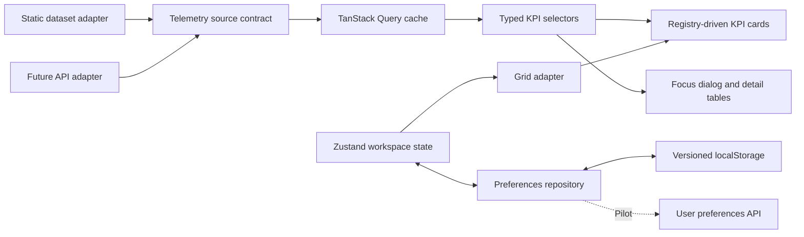

# Airport Operations Analytics: implementation plan

Planning baseline: 17 September 2026. This is a proposed delivery plan, not an implemented or tested application.

## 1. Recommendation

Build a frontend PoC with all 13 requested KPIs, a realistic static dataset, and a reusable widget architecture. Demonstrate whether users can spot an operational issue, investigate it, and arrange a workspace around it. Evolve the same frontend through a read-only integration pilot before production release.

Scope update: the PoC uses static data as requested. No simulator, live-update timers, polling, backend, or streaming is required. Preserve a small data-source interface so production feeds can be added later.

The original prompt specifies the visual ingredients well but leaves several consequential behaviors undefined: metric denominators, filter applicability, focus-state preservation, layout migration, source freshness, and the transition from mock data to backend data. Those contracts are the foundation of this plan.

### Working assumptions

- One fictional airport, three terminals, one currency, one configurable IANA timezone. Use Asia/Kolkata and INR as initial demo configuration, not hard-coded application rules.
- Primary users: duty managers and terminal supervisors. Desktop is the primary editing surface; mobile supports monitoring, focus, reorder, and size presets.
- All 13 KPIs ship in the PoC. None require real airport credentials or passenger-level personal data.
- Data is bundled with a fixed reference timestamp. Filters and detail views operate on that dataset; nothing changes automatically over time.
- PoC preferences are browser-local. Shared/team layouts and authenticated user profiles belong to the pilot.
- The application is read-only with respect to airport operations. Dashboard settings affect presentation only.

## 2. Technology selection and verification

Official documentation was reviewed for the decisions below. An installation and runtime compatibility test is still required in milestone 1; documentation review does not prove the combined dependency graph works.

| Layer               | Selected baseline                                | Reason and verification                                                                                                                                                                                                                                                                                                    |
| ------------------- | ------------------------------------------------ | -------------------------------------------------------------------------------------------------------------------------------------------------------------------------------------------------------------------------------------------------------------------------------------------------------------------------- |
| UI                  | React 19 + strict TypeScript                     | Suits a component-based, highly interactive dashboard. The official site currently documents React 19; select the tested patch during the spike. [React versions](https://react.dev/versions).                                                                                                                             |
| Tooling             | Vite 8 + Node.js 24 LTS + npm lockfile           | A static SPA is sufficient for this internal dashboard. Vite 8 is released; Node 24 is an LTS line. [Vite 8](https://vite.dev/blog/announcing-vite8), [Node release status](https://nodejs.org/en/about/previous-releases).                                                                                                |
| Styling             | Tailwind CSS 4 + `@tailwindcss/vite`             | Use the documented Vite integration and semantic CSS variables for theme tokens. [Tailwind Vite installation](https://tailwindcss.com/docs/installation/using-vite).                                                                                                                                                       |
| Grid                | React Grid Layout 2                              | Built-in responsive drag/resize matches the core interaction. Use its typed API, container measurement hook, and explicit layouts; wrap library types at the layout boundary. [Official repository](https://github.com/react-grid-layout/react-grid-layout).                                                               |
| Charts              | Recharts 3                                       | Appropriate for 13 relatively small, aggregated operational charts. ResponsiveContainer owns chart sizing through ResizeObserver. [ResponsiveContainer](https://recharts.github.io/api/ResponsiveContainer/).                                                                                                              |
| UI primitives       | Radix Dialog, Dropdown Menu, Tooltip             | Supports focus trapping, keyboard behavior, and accessible dialog structure. Application-level testing remains necessary. [Radix Dialog](https://www.radix-ui.com/primitives/docs/components/dialog).                                                                                                                      |
| UI state            | Zustand                                          | Store layout drafts, saved preferences, and display settings. Version and migrate persisted data, with separate runtime validation. [Zustand persistence](https://zustand.docs.pmnd.rs/reference/integrations/persisting-store-data).                                                                                      |
| Data access         | TanStack Query 5                                 | One owner for asynchronous snapshot/detail reads and caching; the static adapter resolves locally with polling and automatic refetch disabled. Later the same query hooks can call HTTP. Do not duplicate KPI data in Zustand. [TanStack Query overview](https://tanstack.com/query/latest/docs/framework/react/overview). |
| Boundary validation | Zod 4                                            | Validate external telemetry and saved preferences before using them. Infer appropriate TypeScript contracts from schemas. [Zod](https://zod.dev/).                                                                                                                                                                         |
| Icons/type          | Lucide React; locally bundled Inter              | Consistent controls and predictable typography without a runtime font CDN dependency.                                                                                                                                                                                                                                      |
| Verification        | Vitest + React Testing Library; Playwright + axe | Test formulas and state transitions, then exercise real browser geometry and keyboard behavior. Automated accessibility checks require manual checks too. [Vitest](https://vitest.dev/guide/), [Playwright accessibility](https://playwright.dev/docs/accessibility-testing).                                              |

### Alternatives and decision limits

- **Recharts versus Chart.js:** choose Recharts for React composition, consistent theming, and the expected bounded datasets. The choice must pass the resize/focus spike. If measured performance with the required data fails, evaluate a canvas renderer with the same data contracts; do not maintain two chart stacks in the PoC.
- **React Grid Layout versus custom CSS Grid:** CSS Grid can express placement, but the project would still have to implement drag collision rules, compaction, resize constraints, breakpoint persistence, and pointer behavior. The existing engine reduces that custom work. Keyboard reorder and size menus remain application responsibilities.
- **Vite SPA versus a server-rendered framework:** the stated scope does not require public indexing or server-rendered landing pages. Keep deployment as static assets plus a later API. Authentication can be added without changing the frontend framework.
- **Local state versus two state libraries:** Zustand owns user/workspace state; TanStack Query owns asynchronously obtained data. Components use local state for temporary presentation details. Each datum has one authoritative owner.
- **Infrastructure:** no production database or event broker is required for the browser-only PoC. Start the pilot with a modular API service and relational preference storage if there is no existing platform. Select analytics storage and streaming infrastructure after measuring event rates, retention, and latency needs.

## 3. Product experience

Use a header with airport name, “Static demo data” badge, dataset as-of time in the airport timezone, and an Edit layout action. The sidebar contains time, terminal, and movement filters. Category navigation scrolls to groups in one overview; it does not create separate layout copies.

The initial desktop view emphasizes passenger throughput, security wait, and flight status. Remaining cards follow in passenger flow, airside, baggage/logistics, and facility/commercial groups. Users can rearrange any card across these initial groups; category navigation then targets the first visible card of that category.

Normal mode protects the dashboard from accidental dragging. Editing mode exposes drag/resize handles and a Save/Cancel bar. Changes affect an in-memory draft. Save validates and persists the draft; Cancel restores the last saved layout. Reset loads defaults into the draft. Hide offers immediate undo, while a Restore cards menu makes every hidden KPI recoverable.

Each card has a title, main value and unit, scope/freshness labels, visualization, focus action, and settings menu. Settings provide chart/table display and display density; applicable cards add a breakdown choice. Hide is a presentation preference, never deletion of source data.

### Main Frame behavior

Focus opens a near-fullscreen Radix dialog through a portal. It contains the same KPI at greater detail: expanded chart, breakdown controls, data table, target/reference information, formula, and dataset as-of time. The dashboard remains mounted, with modal interaction blocked behind it. Focus and overview read the same static source/cache.

Use one focused widget ID and shared widget settings. No layout coordinate changes occur. Escape and close restore scroll position and keyboard focus. Focus-mode breakdown choices are temporary unless explicitly applied to the card. Use a short opacity/scale transition; respect reduced motion.

## 4. KPI and filter contract

These are proposed demo definitions, not claims of airport-industry standards. An operations owner must approve production definitions and targets.

In the table: T = terminal filter; M = movement filter. Time applies to windowed metrics, while snapshots use the latest sample at the selected window endpoint. Unsupported filters retain valid data with an explicit scope label. A supported but empty selection shows no data. A logically incompatible selection shows not applicable.

| KPI                   | Definition and chart                                                                                                                                                                                                                 | Filters and focus detail                                                                                                       | Candidate production source                                          |
| --------------------- | ------------------------------------------------------------------------------------------------------------------------------------------------------------------------------------------------------------------------------------ | ------------------------------------------------------------------------------------------------------------------------------ | -------------------------------------------------------------------- |
| Passenger throughput  | Passenger movements processed in each interval; line versus interval forecast. Separate Today total versus daily forecast.                                                                                                           | T, M. Terminal/direction breakdown; comparable-period variance. Transfers may count as multiple movements and must be labeled. | Terminal counting feeds or reconciled passenger operations data.     |
| Security wait         | Mean completed queue wait in minutes per checkpoint; horizontal bars. Green <10, amber 10–20 inclusive, red >20.                                                                                                                     | T; departures only. Arrivals selection is not applicable. Focus shows samples and p95.                                         | Queue sensors/checkpoint management.                                 |
| Check-in density      | Latest queued passenger count / configured queue capacity; status cards.                                                                                                                                                             | T; departures only. Focus by zone/counter group, with wait and staffing context.                                               | Check-in/queue monitoring.                                           |
| Baggage delivery      | Mean first-to-last-bag duration for completed belt deliveries; target bars. In-progress deliveries shown separately.                                                                                                                 | T; arrivals only. Focus by belt, airline, and flight.                                                                          | Baggage handling/reconciliation systems.                             |
| On-time performance   | Completed eligible movements no more than 15 minutes late / completed eligible movements with valid times. Arrival uses actual versus scheduled in-block; departure uses off-block. Exclude cancellations and count them separately. | T, M. Donut, numerator/denominator, airline breakdown, excluded-record count. Time window is based on scheduled event time.    | Airport operational database and reconciled airline movement events. |
| Flight status         | Scheduled movements in the window, partitioned by arrival/departure and mutually exclusive on-time/delayed/cancelled/unknown status. Use actual delay when completed, predicted delay when pending.                                  | T, M. Separate stacked bars; focus table shows lifecycle and delay. Cancelled takes precedence; missing timing gives unknown.  | Airport operational database.                                        |
| Runway utilization    | Union of occupied intervals / available runway seconds in the window; area chart. Slot usage = used allocated slots / allocated slots, separately labeled.                                                                           | Airport-wide; T and M do not alter physical utilization. Focus by runway, occupancy timeline, and planned/used slots.          | Airfield movement and slot feeds.                                    |
| Turnaround time       | Mean off-block minus preceding on-block for completed aircraft turns, assigned to the departure terminal/window.                                                                                                                     | T; paired-turn metric independent of M, labeled accordingly. Focus by airline and aircraft type, median and p95.               | Turnaround milestones/airport operational database.                  |
| Baggage mishandling   | Lost/delayed bag incidents recorded in the window / passenger movements in the same reporting window ×1,000. Label as a reporting-window proxy, since incident attribution may lag travel.                                           | T, M only where incident attribution exists. Seed attributed demo data. Focus counts, rate, report lag, and definition.        | Baggage tracing/claims data, usually delayed.                        |
| Cargo throughput      | Processed cargo mass in metric tonnes; value plus target progress.                                                                                                                                                                   | Airport-wide cargo facility; T does not apply. M uses inbound/outbound mapping. Focus by cargo class and handling zone.        | Cargo management/warehouse systems.                                  |
| Parking occupancy     | Occupied / open spaces per garage at endpoint; radial bars and counts.                                                                                                                                                               | T uses explicit garage-to-terminal mapping; M does not apply. Focus garage breakdown and occupancy history.                    | Parking access/capacity systems.                                     |
| Retail/dining revenue | Net sales excluding tax and after refunds in the window, using one configured currency; sparkline and category totals.                                                                                                               | T; M does not apply. Focus by concession/category and hourly totals.                                                           | Aggregated point-of-sale feeds.                                      |
| Gate availability     | Endpoint counts of free, occupied, reserved, unavailable gates, reconciling to total gates; matrix.                                                                                                                                  | T; M does not apply to physical availability. Focus gate status, next assignment, and last change.                             | Gate allocation/resource management.                                 |

Additional calculation rules:

- Global windows: Last hour, Last 6 hours, Today. In the PoC, resolve them against the dataset reference timestamp, not the current wall clock. Resolve Today at midnight in the configured airport timezone; persist UTC timestamps. In production the source adapter supplies the current as-of time.
- Weight aggregate averages by sample counts. Recompute percentages from summed numerators/denominators. Do not average terminal percentages.
- Zero denominator means unavailable, not 0%. A true observed zero is distinct from missing telemetry.
- Show matched-window forecasts/targets for windowed comparisons. Daily goals remain separately labeled. For a zero forecast, show absolute variance without a percentage.
- Separate physical occupancy from movement-attributed activity; never scale capacity according to an unrelated filter.
- Include units, source time, aggregation period, definition version, and exclusions in detail views.

## 5. Architecture and project structure



This is one application with clear module boundaries. A monorepo or runtime plugin framework is unnecessary for the initial scope.

```text
airport-operations/
  package.json
  package-lock.json
  index.html
  vite.config.ts
  tsconfig.json
  eslint.config.js
  playwright.config.ts
  .env.example
  README.md
  public/fonts/
  src/
    main.tsx
    App.tsx
    app/providers.tsx
    config/airport.ts
    domain/types.ts
    domain/schemas.ts
    domain/kpiDefinitions.ts
    data/TelemetrySource.ts
    data/mockData.ts
    data/StaticTelemetrySource.ts
    features/telemetry/useTelemetry.ts
    features/telemetry/queryKeys.ts
    features/telemetry/selectors.ts
    features/dashboard/DashboardGrid.tsx
    features/dashboard/KPICard.tsx
    features/dashboard/FocusDialog.tsx
    features/dashboard/WidgetSettings.tsx
    features/dashboard/widgetRegistry.ts
    features/dashboard/gridAdapter.ts
    features/dashboard/layoutDefaults.ts
    features/dashboard/layoutStore.ts
    features/dashboard/layoutSchema.ts
    features/dashboard/preferencesRepository.ts
    features/dashboard/LocalPreferencesRepository.ts
    features/filters/FilterSidebar.tsx
    widgets/passenger-flow/
    widgets/flight-operations/
    widgets/baggage-logistics/
    widgets/facility-commercial/
    components/charts/ChartFrame.tsx
    components/ui/
    styles/tokens.css
    styles/index.css
  tests/unit/
  tests/components/
  tests/e2e/
  docs/kpi-catalog.md
  docs/demo-script.md
  docs/architecture-decisions.md
```

`types.ts` defines stable widget IDs, coordinates, responsive layout documents, filters, normalized KPI payloads, and source metadata. Use a discriminated union or a keyed payload map so a security widget cannot receive a revenue payload. A registry entry supplies its renderer, detail renderer, supported dimensions, units, and size constraints.

`KPICard.tsx` owns presentation and actions. The grid engine owns drag/resize mechanics and injects handles through the wrapper. `ChartFrame.tsx` centralizes chart sizing, loading/error presentation, and chart/table switching. `DashboardGrid.tsx` coordinates the registry and grid adapter. `App.tsx` composes the shell and providers rather than holding business calculations.

### Telemetry boundary

Define asynchronous `getSnapshot(filters, signal)` and `getDetails(widgetId, filters, breakdown, signal)` methods. Snapshot payloads carry all overview KPIs, dataset as-of time, definition version, data scope, mode, and optional per-KPI quality metadata. Detail responses use the same dataset revision. Accept an AbortSignal now so a future HTTP adapter can cancel obsolete requests; static reads simply resolve locally.

Implement only `StaticTelemetrySource`. It reads the bundled dataset, applies filters, and computes display aggregates through pure selectors. Put at least 24 hours of history and sufficient detail records in `mockData.ts`. Include a clear Terminal 2 congestion issue, consistent gate/flight totals, and plausible revenue/cargo targets. Keep series to about 120–240 points. No random generator or scenario engine is necessary.

Use one snapshot query for the active overview filter key. Details query only when opened; share overview data where possible. Include dataset revision, airport, and every effective filter in cache keys. For static mode disable polling, retries, and automatic focus/reconnect refetch; data stays fresh indefinitely for that fixture revision. This configuration is adapter-specific, so production can use its own policies.

Relative time windows use the fixed dataset timestamp. Otherwise a demo that works today would become empty tomorrow. Clearly label the displayed date and avoid a “Live” badge or a wall-clock-based stale warning.

Provide loading, empty, and error components with focused component-test fixtures. Do not add outage simulation controls or automatic health monitoring. When production integration begins, extend optional metadata with actual source timestamps, per-source freshness expectations, last-known values, and recovery behavior. Keep these responsibilities in the data layer.

### Layout boundary

Store `{ schemaVersion, airportId, layoutsByBreakpoint, hiddenWidgetIds, widgetSettings, updatedAt }`. Maintain a separate draft while editing. Exclude telemetry and transient focus state from persistence.

Use 12 desktop columns, 6 tablet columns, and a single-column mobile representation. Derive breakpoints from available dashboard width, not only viewport width. Closing the sidebar must remeasure the grid. Keep explicit breakpoint layouts so mobile use cannot overwrite desktop positions.

Validate IDs, integer bounds, minimum sizes, and collision rules when restoring. Migrate supported old schemas; recover to defaults with a clear message if migration or parsing fails. Merge newly introduced registry widgets deterministically. Keep the current draft usable when localStorage is denied or full.

## 6. Implementation milestones

Estimates are engineering working days for one experienced frontend engineer with timely design/domain feedback. They exclude stakeholder waiting time and production source integration. They are planning ranges, not a fixed commitment.

| Milestone                              | Work and dependencies                                                                                                                                                  | Exit criteria                                                                                                                                                 | Estimate   |
| -------------------------------------- | ---------------------------------------------------------------------------------------------------------------------------------------------------------------------- | ------------------------------------------------------------------------------------------------------------------------------------------------------------- | ---------- |
| 0. Definitions and demo design         | Record demo assumptions, KPI formulas, filter matrix, wireframe, and baseline performance environment.                                                                 | Reviewable KPI catalog and agreed PoC scope; production definitions remain subject to domain review.                                                          | 0.5–1 day  |
| 1. Compatibility and interaction spike | Scaffold tested dependencies. Implement passenger line, security bar, and gate matrix in the real grid with a dialog, edit draft, and saved coordinates. Depends on 0. | Install/build/typecheck pass; drag/resize, focus return, and reload restoration work in a browser. Record exact package versions and peer-dependency results. | 1.5–2 days |
| 2. Static data boundary                | Typed contracts, one coherent fixture dataset, static adapter, pure filter selectors, and query integration. Depends on 1.                                             | Filtered totals and details agree; relative windows work against the fixed dataset date; replacing the adapter requires no card changes.                      | 1–2 days   |
| 3. Complete dashboard                  | Implement all 13 widgets and focus breakdowns; meaningful settings; all layout commands; responsive shell and design tokens. Depends on 2.                             | Every control works; all KPI definitions and scope labels are visible; user can complete the demo journey.                                                    | 3–5 days   |
| 4. Reliability and demo packaging      | Browser tests, keyboard/manual accessibility review, interaction profiling, storage recovery, docs, CI and deployable static build. Depends on 3.                      | Acceptance checklist passes with recorded evidence, repeatable demo script, and documented limitations.                                                       | 2–3 days   |

Total: approximately **8–13 engineering days**, normally **2–3 calendar weeks** including review cycles. The static-data scope removes simulation and live-feed testing while retaining the complete 13-widget interaction experience.

### First vertical slice

Complete passenger throughput, security wait, and gate availability end-to-end before implementing the remaining widgets. Together these exercise time series, thresholds, non-chart visuals, all layout operations, focused detail, and filter applicability. A failure here is inexpensive to correct and informs the architecture before repetition.

## 7. Verification and acceptance

### Automated checks

- Pure calculations: weighted averages, rate denominators, threshold boundaries at 10 and 20, cancellations, zero denominators, missing records, timezone midnight, and overlapping runway occupancy intervals.
- Static dataset: capacities and nonnegative counters hold; arrival/departure status buckets and gate states reconcile; card summaries match detail rows; windows return the same data regardless of the machine's current date.
- Layout: save/cancel/reset, hidden-widget restoration, breakpoint isolation, invalid coordinates, corrupted data, migration, new widgets, and unavailable storage.
- Components: card settings, filter scope labels, no-data versus error states, static-mode labeling, and accessible control names.
- Browser flows: pointer drag/resize, keyboard reorder/size menus, Escape/focus return, layout unchanged after focus, filter changes during fetching, responsive chart bounds, and refresh persistence.
- Run axe on overview, editing, menus, and focus dialog. Manually verify keyboard order, screen-reader interpretation, reduced motion, and color-independent status. Recharts has built-in accessibility support, but provide chart tables and validate the complete experience. [Recharts accessibility](https://github.com/recharts/recharts/blob/main/storybook/stories/API/Accessibility.mdx).

### Measurable PoC targets

Define the reference as a recorded 4-core-or-better laptop with 16 GB RAM, a current Chrome build, a 1440×900 viewport, 13 visible cards, up to 240 points per series, and a production build. Record the exact machine/browser in the report. For cold-load testing use 10 Mbps down, 1 Mbps up, and 100 ms RTT.

| Scenario                  | Proposed pass criterion                                                                                                                                                                     |
| ------------------------- | ------------------------------------------------------------------------------------------------------------------------------------------------------------------------------------------- |
| Cold load                 | Useful dashboard and initial mock data within 3 seconds under the reference network profile.                                                                                                |
| Focus and local filtering | Visible response within 200 ms, excluding intentionally injected network delay.                                                                                                             |
| Pointer resize            | At least 30 fps in the recorded interaction; no chart overflow, blank content, or sustained main-thread stalls above 100 ms.                                                                |
| Final chart size          | Matches the settled content box within 150 ms after resize finishes.                                                                                                                        |
| Repeated interaction      | Fifty focus/close cycles and repeated drag/resize/filter actions produce no uncaught errors or growing observer/listener counts. Reserve a live-update soak test for the integration pilot. |
| Responsive behavior       | No page-level horizontal overflow at 390, 768, 1440, and 1920 CSS pixels; desktop layout is restored after returning from mobile.                                                           |

These are targets to measure, not performance results. If the spike fails, reduce unnecessary renders, data volume, and animation before considering a chart-library change. Charts must have one measurement owner; use Recharts' existing ResizeObserver path and a profiled debounce rather than forced remounts. [ResponsiveContainer API](https://recharts.github.io/api/ResponsiveContainer/).

### PoC acceptance gate

The sponsor can identify a terminal congestion issue, filter to its scope, focus the relevant KPI, inspect its contributing data, adjust the workspace, and save/reload it. All 13 KPIs are functional, static demo mode is obvious, and the documented acceptance checks pass. The handover contains source, lockfile, setup instructions, test evidence, and a static build suitable for an agreed demo host.

## 8. Five-minute demonstration

1. **0:00–0:40 — Orient:** open the default dashboard, explain the static demo badge and dataset date, and scan all four categories.
2. **0:40–1:30 — Detect:** point out the Terminal 2 congestion present in the dataset; show the relationship between passenger flow, check-in density, and security wait.
3. **1:30–2:30 — Investigate:** filter to T2/departures; focus security wait; inspect checkpoint breakdown, p95, and threshold definition.
4. **2:30–3:30 — Personalize:** close focus; edit the layout; enlarge security, move flight status, hide/restore a card; save and reload.
5. **3:30–4:20 — Explore:** switch the time window and terminal; demonstrate that charts and detail tables respond while the saved layout stays intact. Show airport-wide scope labels on runway/cargo cards.
6. **4:20–5:00 — Confirm value:** use keyboard focus controls or the mobile view; ask the reviewer to repeat one investigation unaided and capture what they would need for daily use.

The fixed dataset makes the story repeatable without a simulation engine. Record user completion, incorrect interpretations, and requested changes rather than judging only visual appeal.

## 9. Production evolution

### Gate A: read-only integration pilot

Keep the frontend and contracts. Add an API adapter and a backend aggregation boundary. Ingest airport-source data through server-side connectors, validate it, normalize identifiers and timestamps, and expose aggregated snapshots/details. Keep vendor credentials and raw operational systems behind this boundary.

Integrate a small representative set of actual feeds first: flight movements, security queues, and gate allocation. Validate calculated results against the source system and a domain-approved reference. Define source owners, refresh expectations, late-event handling, deduplication, reporting-day boundaries, and KPI definition versions.

Add organization SSO using its existing identity provider, server-enforced airport/role access, and server-stored user layouts with revision checks to prevent lost updates. Commercial revenue access may require a different permission than operations data. LocalStorage can remain a non-authoritative preference cache.

Add actual source timestamps, source-specific freshness thresholds, partial failures, last-known-value retention, retries, and recovery. Keep data mode separate from health: the static PoC has no live-feed freshness requirement, whereas production does. A successful API fetch must not replace an old source timestamp with the current time. Add a 30-minute live-update soak test and tests for stale-to-fresh recovery during this pilot.

Start with snapshot polling when it meets the agreed freshness objective. If push is justified, use a multiplexed SSE stream for server-to-browser telemetry and ordinary HTTP for settings. SSE is one-way, fitting this read-only update direction; adopt WebSockets only if bidirectional requirements warrant them. [MDN server-sent events](https://developer.mozilla.org/en-US/docs/Web/API/Server-sent_events/Using_server-sent_events).

For streaming, require event IDs, sequence/revision numbers, heartbeat, reconnect backoff, deduplication, gap detection, and snapshot resynchronization. Solve the race between fetching a snapshot and starting a stream through a snapshot cursor/replay contract. Align stream authentication, proxy buffering, and idle timeouts with the hosting platform. Push transport does not make a slow source fresh.

Pilot exit: approved KPI reconciliation, authenticated read-only access, tested source interruption/recovery, and observed performance at expected pilot load.

### Gate B: production readiness

- Replace all remaining synthetic feeds and secure sign-off on every KPI definition, target, source, and permitted audience.
- Agree service objectives: concurrent sessions, terminals/airports, freshness per source, history retention, recovery time, and recovery point. Size and load-test against these targets.
- Keep one modular backend initially. Use PostgreSQL for users/preferences/configuration if there is no established alternative; use an existing analytics store where appropriate. Introduce queues, streaming platforms, specialized time-series storage, or caching only when ingestion/query measurements justify them.
- Enforce access in APIs and streams, scope caches by airport/tenant, and log administrative changes to shared views and thresholds. Keep personal layout editing distinct from operational configuration.
- Add structured logs, request correlation, error reporting, telemetry-lag metrics, stream reconnect metrics, and alert ownership. Measure source health separately from web-server health.
- Provide staging and production environments, automated checks, dependency/license review, release rollback, database migrations, backups with restoration tests, and an incident runbook.
- Run manual accessibility validation, supported-browser testing, security review, failover/recovery exercises, and operator acceptance testing.
- Train support owners and establish a change process for KPI definitions, thresholds, and feed mappings.

Production exit: all agreed reliability, security, accessibility, data-correctness, recovery, and support criteria have evidence and named owners. Passing the PoC gate alone does not satisfy this gate.

### Decisions needed before a production estimate

Identify the target airport(s), actual feed vendors and access methods, hosting/network constraints, identity provider, commercial-data restrictions, expected users, retention, and per-KPI freshness requirements. These determine integration effort and deployment topology; a credible production schedule depends on them.

## 10. Principal risks and mitigations

| Risk                                             | Mitigation                                                                                                               |
| ------------------------------------------------ | ------------------------------------------------------------------------------------------------------------------------ |
| Attractive but misleading metrics                | Approve definitions, units, denominators, source lag, and filter scope; reconcile against reference data.                |
| Layout works only with a mouse                   | Provide explicit keyboard move and size commands; test them during the initial spike.                                    |
| Resize stutters with many charts                 | Bound series, separate layout and data state, share cache, suppress expensive animations, and profile real interactions. |
| A filtered view corrupts saved coordinates       | Filters change data only; keep explicit saved/draft layouts by breakpoint.                                               |
| Static values are hard-coded inside components   | Bundle fixtures behind a typed source adapter; cards consume the same contract that a future API will return.            |
| Relative date filters expire after the demo date | Anchor PoC windows to the fixed dataset timestamp and label that date clearly.                                           |
| Feed refresh masks old values                    | Preserve observed timestamps and per-KPI quality, independently of fetch success.                                        |
| Production scope expands without evidence        | Use PoC and pilot gates; size backend infrastructure against measured source and user workloads.                         |
